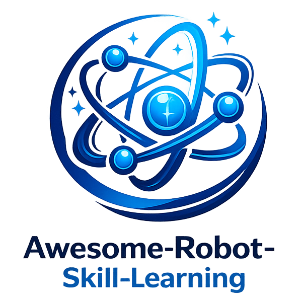

# Awesome-Robot-Skill-Learning

## Introduction

Awesome-Robot-Skill-Learning is a curated collection of resources, papers, datasets, and tools related to robot skill learning. Our goal is to provide researchers and practitioners with a comprehensive overview of the latest advancements in teaching robots to acquire new skills through machine learning approaches.
